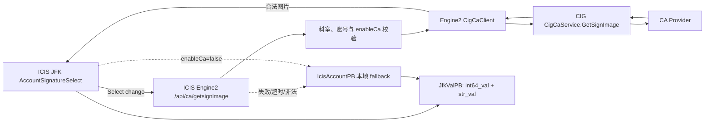

# ICIS JFK 账号签名重构与 CA 实时签名接入设计

> 状态：已实现；代码与本地自动化验证完成，待医院环境 CIG/CA 端到端联调  
> 编写日期：2026-08-09  
> 实施更新：2026-08-10  
> 涉及仓库：`jingyi_icis_frontend`、`jingyi_icis_engine2`  
> 依赖系统：`jingyi_cig`  
> 本文同时记录设计基线和实际落地结果，不包含医院环境部署操作。

## 1. 文档目的

本文给出 ICIS JFK 表单中账号签名字段的前后端重构方案，并设计 ICIS Engine2 经 CIG 获取 CA 实时签名的适配方式。

方案与 AIMS 的 `jfk-account-signature-refactor-plan.md` 保持相同的产品规则：

- 签名选择项来自科室账号，而不是已经解析出的图片字符串；
- 选中账号后，同时保存账号主键和已解析的签名快照；
- 开启 CA 时，仅在用户实际改变 Select 选项时实时请求一次 CA 签名；
- CA 失败后无感降级到账号本地资料；
- 账号签名能力抽取为独立前端模块；
- 普通图片和账号签名使用不同的 JFK 值类型；
- 账号签名允许人工覆盖 `JFK_DATA_SOURCE` 字段；
- 浏览、打印、归档和普通重渲染不触发实时 CA 请求。

本文同时处理 ICIS 与 AIMS 的差异：

- ICIS 账号数据库主键是 `BIGINT`，前端不得用 JavaScript `number` 作为权威表示；
- ICIS 账号同时存在数据库主键 `id` 和登录账号 `account_id`；
- ICIS 的科室关系表通过登录账号关联，而 CA/CIG 接口通过数据库主键关联；
- ICIS 已存在紧凑打印签名字段需求，新增类型不能破坏现有枚举编号和归档渲染；
- ICIS 当前通用设置结构、账号接口和 JFK 渲染代码与 AIMS 不同。

## 2. 参考资料与约束优先级

### 2.1 参考资料

1. CIG CA 代理与 gRPC 需求：
   `/Users/guzhenyu/gDocs/jingyi/jingyi_3d/jingyi_cig/docs/03_ca_proxy_and_grpc_requirements.md`
2. AIMS JFK 账号签名重构方案：
   `/Users/guzhenyu/gDocs/jingyi/aims_repos/jingyi_aims_frontend/docs/jfk-account-signature-refactor-plan.md`
3. ICIS 紧凑打印签名字段需求：
   `jingyi_icis_engine2/docs/requirements/compact_signature_image_fields.md`
4. 本轮对话中已经确认的产品和技术决策。

### 2.2 约束优先级

发生冲突时按以下优先级处理：

1. 本轮已确认的产品规则；
2. 本文针对 ICIS 的适配规则；
3. AIMS 方案中的通用规则；
4. CIG 协议约束；
5. 现有实现细节。

本文只扩展 CIG 文档中“ICIS 客户端尚未接入”的范围，不改变 CIG 已定义的 CA Provider、`GetSignImage` gRPC 协议和来源系统含义。CIG 文档中与 PDF 二维码闭环有关的未实现事项，也不属于本次范围。

ICIS 实现进入开发时，必须同步更新 CIG 的 `03_ca_proxy_and_grpc_requirements.md`：将 ICIS 客户端接入状态标记为“实施中”；联合验收通过后改为“已接入”，并记录对应的 ICIS Engine2 和 CIG 版本。该状态同步不修改现有 gRPC 契约。

## 3. 已确认的需求基线

### 3.1 字段类型

- `IMAGE` 继续表示普通图片，不再隐式表示“从全部科室账号选择签名”。
- 新增明确的账号签名类型 `ACCOUNT_SIGN_PIC`。
- `NURSING_SIGN_PIC` 和 `DOCTOR_SIGN_PIC` 保留现有语义。
- ICIS Proto 已使用 `STRINGS = 9`，因此 `ACCOUNT_SIGN_PIC` 必须使用新编号 `10`，不得复用或调整旧编号。

映射如下：

| JFK 值类型 | 数值 | Select 数据源 | 用途 |
| --- | ---: | --- | --- |
| `IMAGE` | 6 | 无账号 Select | 普通图片 |
| `NURSING_SIGN_PIC` | 7 | `deptNurses` | 护士签名 |
| `DOCTOR_SIGN_PIC` | 8 | `deptDoctors` | 医生签名 |
| `STRINGS` | 9 | 无账号 Select | 现有字符串数组，保持不变 |
| `ACCOUNT_SIGN_PIC` | 10 | `deptAccounts` | 科室全部账号签名 |

### 3.2 账号选择项

- 账号集合分为 `deptAccounts`、`deptNurses`、`deptDoctors`，三者都是数组。
- option 的 `value` 使用账号数据库主键 `IcisAccountPB.id`。
- option 的 `label` 使用 `IcisAccountPB.accountName`。
- `accountName` 为空的账号不展示，不对 label 做其他字段 fallback。
- `isDisabled != 0` 的账号不展示。
- 按数据库主键 `id` 进行数值升序排列。
- 暂不新增最小化账号 DTO；接口可以返回完整 `IcisAccountPB`，但前端签名模块只使用所需字段。
- 暂不新增独立签名权限点。

### 3.3 选中后的值

选择账号后，字段值同时保存：

- `JfkValPB.int64_val`：选中账号的数据库主键；
- `JfkValPB.str_val`：当次解析得到的签名图片或 fallback 文本快照。

其中：

- `int64_val` 用来可靠恢复 Select 的选中状态；
- `str_val` 用来保证历史记录、归档和打印不依赖账号资料的后续变化；
- 旧数据若只有 `str_val`，继续显示旧快照，但不根据图片或姓名反向猜测账号；
- 清空选择时必须同时清空 `int64_val` 和 `str_val`。

### 3.4 本地 fallback

ICIS 账号没有 AIMS 的 `staffNo` 字段。ICIS 对应的 fallback 次序定义为：

```text
caSignPic -> signPic -> accountName -> accountId -> id
```

说明：

- `accountId` 是 ICIS 登录账号/工号标识；
- `id` 是数据库 `BIGINT` 主键，作为最终文本兜底；
- 空字符串和只包含空白的字符串视为无值；
- fallback 的结果既可能是图片，也可能是普通文本。

### 3.5 CA 实时签名

- `AppSettingsPB.enableCa == true` 时，用户实际改变账号 Select 后，前端实时请求 ICIS Engine2。
- ICIS Engine2 调用 CIG `CigCaService.GetSignImage`。
- 获取并验证成功后，将实时 CA 图片写入 `str_val`。
- 获取失败、超时、响应非法或图片校验失败时，无感降级到本地 fallback。
- `enableCa == false` 时不发起 CA 请求，直接使用本地 fallback。
- 不展示 warning，不阻止字段回填和保存。
- 不做持久缓存，不做短期缓存，不合并并发请求。
- 用户连续切换时取消旧请求，并用请求序号避免旧响应覆盖新选择。
- CA 实时结果仅作为本次字段快照，不反写账号表。

### 3.6 编辑范围

- `USER_INPUT` 的账号签名字段允许编辑。
- `JFK_DATA_SOURCE` 的账号签名字段也允许人工覆盖。
- 只放开账号签名类型的 `JFK_DATA_SOURCE` 人工覆盖，不连带放开其他数据源字段。
- 人工覆盖值必须进入 JFK 实例自身的覆盖值集合，不能改写原始数据源。
- 数据刷新不得静默覆盖人工签名；只有用户显式清空或执行明确的“恢复数据源”动作才移除覆盖。

## 4. 现状说明

### 4.1 ICIS 前端现状

当前签名相关状态仍然以已经解析后的键值对为中心：

```ts
nursingSignPics: StrKeyValPB[]
doctorSignPics: StrKeyValPB[]
```

主要问题如下：

1. Select 的值是 `strVal`，通常是图片内容或文本，而不是账号主键。
2. 选中项无法稳定恢复：相同图片、图片变更或 fallback 文本相同都会造成歧义。
3. `FieldValueView.tsx`、`JfkPageView.tsx` 和 `useJfkRenderEngine.tsx` 分散处理 IMAGE/护士/医生签名，职责重叠。
4. `useJfkRenderEngine.tsx` 还维护局部 `signImages`、护士图片和医生图片，并通过 `allowedVals` 限制输入，状态来源不统一。
5. `IMAGE`、`NURSING_SIGN_PIC`、`DOCTOR_SIGN_PIC` 被统一当作账号图片处理，普通图片和账号签名边界不清楚。
6. 当前只允许 `USER_INPUT` 进入签名选择流程，数据源签名字段无法人工覆盖。
7. 当前展示逻辑通常只尝试图片渲染，缺少“图片或 fallback 文本”的统一视图。
8. `primitiveToVal` 等通用转换函数只写一个值字段，不能表达 `int64_val + str_val` 的签名值。
9. 当前前端手写 `JfkValPB.int64Val?: number`，对 PostgreSQL `BIGINT` 存在超过 JavaScript 安全整数范围后的精度风险。

当前账号数据结构已经包含：

- `id`：数据库主键，前端实际接收为十进制字符串；
- `accountId`：登录账号；
- `accountName`：姓名；
- `signPic`：本地签名；
- `departments`：科室信息。

但尚未完整暴露 `caSignPic` 和 `isDisabled`，也没有面向 JFK 签名的一次性科室账号目录接口。

### 4.2 ICIS Engine2 现状

当前 `ReportService.getJfkSignPics`：

- 根据科室查询账号；
- 根据 `JfkConfig.nursing_role_ids` 和 `doctor_role_ids` 判断护士、医生；
- 最终只返回 `StrKeyValPB` 图片/姓名键值对；
- 丢失账号数据库主键以及其他 fallback 字段。

当前 `IcisAccountPB` 已包含 `sign_pic`、科室信息和数据库主键 `id`，但没有对外映射：

- `ca_sign_pic`；
- `is_disabled`。

当前设置模型中没有 `enable_ca`。Engine2 也没有 ICIS 侧的 `/api/ca/getsignimage` HTTP 入口和 CIG CA gRPC 客户端适配。

### 4.3 ICIS 账号和科室关系的特殊点

ICIS 同时存在两种账号标识：

| 标识 | 类型 | 用途 |
| --- | --- | --- |
| `accounts.id` / `IcisAccountPB.id` | PostgreSQL `BIGINT` / Proto `int64` | Select 稳定值、CIG CA 请求账号 ID |
| `accounts.account_id` / `IcisAccountPB.accountId` | 字符串 | 登录身份、科室关系关联、文本 fallback |

`rbac_accounts_departments` 通过字符串 `account_id` 关联科室。因此后端校验目标账号时必须：

1. 先用请求中的数据库主键 `id` 查询目标账号；
2. 再用目标账号的 `account_id` 校验科室关系；
3. 调用 CIG 时仍传数据库主键 `id`。

不能直接拿数据库主键去查询当前的科室关系字段。

### 4.4 CIG 现状

CIG 的公开 Proto 已定义：

- `CigCaService.GetSignImage`；
- `CA_SOURCE_SYSTEM_ICIS`；
- 请求中的 `int64 account_id`；
- 响应中的图片 bytes、media type、SHA-256、宽高、来源和 Provider。

CIG 已能按 ICIS 来源查询账号绑定并调用 CA Provider。本方案需要新增的是 ICIS Engine2 客户端接入，不新增另一套 CA Provider 协议。

### 4.5 紧凑打印现状

`compact_signature_image_fields.md` 已规定 `NURSING_SIGN_PIC` 和 `DOCTOR_SIGN_PIC` 在紧凑数据源中携带 `accounts.sign_pic` 或 fallback 文本。

本方案必须保证：

- 现有 7、8 枚举编号和含义不变；
- 归档/打印继续消费保存好的 `str_val`；
- 打印过程中不实时访问 CA；
- 新增的 `ACCOUNT_SIGN_PIC = 10` 也能按“图片或文本快照”打印；
- 现有紧凑数据源字段不因新增账号选择能力而自动变成 CA 实时字段。

## 5. 重构目标与非目标

### 5.1 目标

1. 将账号目录、option 生成、实时 CA 请求、响应校验、本地 fallback 和 JFK 值构造抽到独立前端模块。
2. 用完整 `IcisAccountPB` 生成 Select，而不是用签名图片反向映射账号。
3. 用 `int64_val` 稳定保存账号身份，用 `str_val` 保存渲染快照。
4. 通过 ICIS Engine2 统一完成权限、配置、目标账号和 CIG 响应校验。
5. 保证普通图片、账号签名和历史数据兼容。
6. 保证局域网 HTTP 页面在没有 Web Crypto API 时仍可完成 SHA-256 校验并展示合法 CA 图片。
7. 让直接 HTTP 调用和前端调用具有一致的安全边界。

### 5.2 非目标

- 不把浏览器直接连接到 CIG。
- 不新增独立签名权限点。
- 不设计 CA Provider 本身。
- 不修改 CIG Provider 的业务协议。
- 不缓存实时 CA 签名。
- 不把实时 CA 图片持久化回 `accounts.ca_sign_pic` 或 `accounts.sign_pic`。
- 不对 `IcisAccountPB` 做全面脱敏改造。
- 不批量迁移所有旧 `IMAGE` 字段。
- 不在打印、归档或历史查看阶段重新获取 CA 签名。

### 5.3 本次实施结果

截至 2026-08-10，本文定义的前后端主链路已经落地：

- ICIS 前端新增独立 `renderer/signature` 模块、账号目录状态、`ACCOUNT_SIGN_PIC = 10`、App Settings CA 开关、实时请求校验与本地 fallback；
- ICIS 前端的 `JfkValPB.int64Val` 对账号签名使用十进制字符串，数据源文本字段和表格单元格均支持人工覆盖；
- Engine2 新增签名账号目录、`enableCa` 设置读改写、同源 `/api/ca/getsignimage`、CIG gRPC 客户端、权限与图片响应校验；
- Engine2 已 vendoring CIG 三份公开 CA Proto，并通过 lock/check 脚本固定来源版本；
- 旧 `/api/report/getjfksignpics` 及其前后端调用已在同一版本移除，不保留兼容层；
- CIG gRPC 契约未修改，CIG 文档已同步记录 ICIS 客户端接入状态和版本；
- 本地前端 production build、前端 31 项测试、Engine2 283 项测试和 Proto lock check 均通过。

医院实际 CIG 地址、账号绑定、Provider 和真实 CA 图片仍需按第 21 节完成环境联调。

## 6. 总体架构与数据流



关键边界：

- 浏览器只访问同源 ICIS Engine2；
- Engine2 是认证、授权、开关和响应验证边界；
- CIG 是 CA Provider 适配边界；
- JFK 实例只保存最终快照，不保存 Provider 交互状态。

## 7. Proto 与 HTTP 契约设计

### 7.1 新增 JFK 值类型

在 `src/main/proto/config/icis_jfk.proto` 中追加：

```proto
enum JfkValTypePB {
  // 原有定义保持不变
  IMAGE = 6;
  NURSING_SIGN_PIC = 7;
  DOCTOR_SIGN_PIC = 8;
  STRINGS = 9;
  ACCOUNT_SIGN_PIC = 10;
}
```

要求：

- 只能追加，不能重新编号；
- 前端常量、编辑器判定、展示判定和后端打印图片类型判断同步加入 10；
- `IMAGE = 6` 从账号 Select 类型集合中移除；
- 图片渲染类型集合与“账号签名可编辑类型集合”应拆成两个常量，避免再次混用。

建议前端常量：

```ts
export const JFK_ACCOUNT_SIGNATURE_VAL_TYPES = [
  JfkValType.ACCOUNT_SIGN_PIC,
  JfkValType.NURSING_SIGN_PIC,
  JfkValType.DOCTOR_SIGN_PIC,
];

export const JFK_IMAGE_OR_SIGNATURE_VAL_TYPES = [
  JfkValType.IMAGE,
  ...JFK_ACCOUNT_SIGNATURE_VAL_TYPES,
];
```

### 7.2 扩展账号 PB

在 `IcisAccountPB` 末尾追加，不调整旧 tag：

```proto
message IcisAccountPB {
  // 现有字段保持不变
  string ca_sign_pic = 13;
  int32 is_disabled = 14;
}
```

`UserBasicOperator.getAllAccounts` 和新签名目录接口需要映射这两个字段。

只读扩展不意味着允许现有账号更新接口写 `ca_sign_pic`。该字段仍由既有后台流程管理，签名选择和实时 CA 获取均不得反写。

### 7.3 科室签名账号目录接口

新增语义明确的账号目录接口，替代旧 `getjfksignpics`：

```text
POST /api/report/getjfksignatureaccounts
```

建议 Proto：

```proto
message GetJfkSignatureAccountsReq {
  string dept_id = 1;
}

message GetJfkSignatureAccountsResp {
  ReturnCode rt = 1;
  repeated IcisAccountPB dept_accounts = 2;
  repeated IcisAccountPB dept_nurses = 3;
  repeated IcisAccountPB dept_doctors = 4;
}
```

接口规则：

1. 校验登录人可访问请求科室；管理员登录账号允许跨科室访问。
2. 只返回未删除且属于科室的账号。
3. 护士和医生角色集合沿用 `JfkConfig.nursing_role_ids`、`doctor_role_ids`。
4. 一个账号可以同时出现在全账号集合和角色集合中。
5. 返回完整账号对象，前端再统一过滤禁用、空姓名并排序。
6. 三个集合在同一响应中返回，保证同一次初始化视图一致。

旧 `/api/report/getjfksignpics` 只供 ICIS 前端使用，且 ICIS 前后端一起发布，因此不设置兼容周期：

- 新前端改为调用 `/api/report/getjfksignatureaccounts`；
- 同一发布版本删除旧 Controller 路由、请求/响应 PB、`ReportService.getJfkSignPics`、旧前端 thunk 和 Redux 图片键值对字段；
- 不保留双接口并行，不提供旧响应适配层；
- 部署时必须同步替换前端静态资源和 Engine2，禁止只发布其中一端；
- 如采用滚动部署，发布流程必须先停止流量或保证前后端作为同一部署单元切换，避免短暂的接口版本错配。

### 7.4 AppSettings CA 开关

在 `icis_settings.proto` 中追加：

```proto
message AppGeneralSettingsPB {
  // tags 1..3 保持不变
  bool enable_ca = 4;
}

message AppSettingsPB {
  // tags 1..10 保持不变
  bool enable_ca = 11;
}
```

建议新增独立更新类型：

```proto
AST_ENABLE_CA = 7;
```

读取时，`SettingService` 将科室的 `AppGeneralSettingsPB.enable_ca` 映射到聚合的 `AppSettingsPB.enable_ca`。

更新时，`AST_ENABLE_CA` 必须先读取现有 `AppGeneralSettingsPB`，只修改 `enable_ca` 后再保存，不能覆盖打印设置、未来时间检查等同一 PB 中的其他字段。

前端 App Setting 页面新增“启用 CA 实时签名”开关，保存成功后同步刷新 Redux 中的 `AppSettingsPB.enableCa`。

### 7.5 CA HTTP 接口

ICIS Engine2 新增：

```text
POST /api/ca/getsignimage
Content-Type: application/json
```

请求：

```json
{
  "deptId": "1",
  "accountId": "1090"
}
```

响应成功示例：

```json
{
  "rt": {
    "code": 0,
    "msg": "ok"
  },
  "accountId": "1090",
  "imageB64": "R0lGOD...",
  "mediaType": "image/gif",
  "sha256": "b377b00a...",
  "width": 120,
  "height": 60,
  "source": 1
}
```

重要约束：

- Proto 内 `account_id` 使用 `int64`；
- Proto JSON 会把 `int64` 序列化为十进制字符串；
- 前端请求、Select、响应比较都使用规范化十进制字符串；
- 不得为了方便转成 JavaScript `number`；
- `deptId` 在 ICIS 现有模型中是字符串，也按字符串处理。

### 7.6 状态码

在现有状态码尾部追加，旧编号不得移动。建议：

```proto
CA_ACCOUNT_NOT_IN_DEPT = 293;
CA_SIGN_IMAGE_NOT_FOUND = 294;
CA_SERVICE_NOT_ENABLED = 295;
CA_SERVICE_UNAVAILABLE = 296;
CA_SERVICE_TIMEOUT = 297;
CA_SERVICE_INVALID_RESPONSE = 298;
CA_SERVICE_ERROR = 299;
LAST_CODE = 300;
```

HTTP 层仍沿用现有项目的业务返回结构。前端不根据具体 CA 错误弹窗，只把所有非成功结果归一为本地 fallback；详细原因进入不含图片内容的诊断日志。

## 8. 前端状态设计

### 8.1 Redux 状态

将签名状态从图片键值对改为账号对象数组：

```ts
interface DragableFormState {
  // 删除或进入兼容期后删除
  // nursingSignPics: StrKeyValPB[];
  // doctorSignPics: StrKeyValPB[];

  deptAccounts: IcisAccountPB[];
  deptNurses: IcisAccountPB[];
  deptDoctors: IcisAccountPB[];
  signatureAccountsDeptId?: string;
  signatureAccountsLoading: boolean;
}
```

初始化规则：

1. JFK renderer 获得有效 `deptId` 后 dispatch 新账号目录请求。
2. 科室变化时清空旧科室集合，再加载新集合。
3. 响应返回时只接受与当前 `deptId` 一致的结果，避免切科室竞态。
4. 页面已有 `getAllAccounts` 可继续服务其他功能，但签名组件只依赖明确的签名目录状态，避免角色集合再次在多个组件内计算。
5. `useJfkRenderEngine` 不再维护三套局部图片数组。

### 8.2 账号规范化

前端签名模块统一使用：

```ts
export type AccountId = string;

export interface SignatureAccount {
  id: AccountId;
  accountId: string;
  accountName: string;
  caSignPic?: string;
  signPic?: string;
  isDisabled?: number;
}
```

`normalizeAccountId` 必须：

- 接受 Proto 生成代码可能提供的 `string | number | bigint`；
- 输出不带前导正号的正十进制字符串；
- 拒绝空值、负数、小数、科学计数法和非数字字符；
- 如果输入是超出安全范围的 JavaScript `number`，直接拒绝，避免保存已丢精度的 ID。

现有手写类型 `JfkValPB.int64Val?: number` 需要调整为与 Proto JSON 一致的 `string | number`，并通过签名专用 helper 读写。更理想的长期方向是统一由 Proto 生成类型管理 int64，但不要求在本次重构中完成全部迁移。

### 8.3 option 生成

核心接口建议为：

```ts
export interface SignatureOption {
  value: AccountId;
  label: string;
  account: SignatureAccount;
}

export function buildSignatureOptions(
  accounts: IcisAccountPB[],
): SignatureOption[];
```

处理顺序：

1. 规范化 `id`；
2. 过滤 ID 非法的账号；
3. 过滤 `isDisabled != 0`；
4. trim `accountName`，过滤空姓名；
5. 以 ID 去重；
6. 按任意长度十进制整数进行数值排序，不能用 `Number(id)`；
7. 输出 `value=id`、`label=accountName`。

十进制大整数排序可比较去除前导零后的字符串长度，再做字典序比较。

## 9. 前端独立签名模块

建议在 JFK renderer 下新增 `signature` 子模块。该模块不直接了解表格、文本字段布局，只负责账号签名领域逻辑。

### 9.1 核心类型

```ts
export type SignatureSource =
  | "realtime-ca"
  | "ca-sign-pic"
  | "sign-pic"
  | "account-name"
  | "account-id"
  | "database-id";

export interface ResolvedSignature {
  accountId: AccountId;
  value: string;
  kind: "image" | "text";
  source: SignatureSource;
}

export interface RealtimeSignatureResponse {
  accountId: AccountId;
  imageB64: string;
  mediaType: "image/png" | "image/jpeg" | "image/gif";
  sha256: string;
  width: number;
  height: number;
  source: number;
}
```

### 9.2 本地解析接口

```ts
export function resolveLocalSignature(
  account: SignatureAccount,
): ResolvedSignature;
```

严格按以下次序返回第一个非空值：

```text
caSignPic -> signPic -> accountName -> accountId -> id
```

其中 `caSignPic`、`signPic` 需要经过图片值规范化。无法识别为图片的非空值仍可按文本快照展示，避免旧资料完全不可见。

### 9.3 实时请求接口

```ts
export interface GetRealtimeSignatureInput {
  deptId: string;
  accountId: AccountId;
  signal: AbortSignal;
}

export async function getRealtimeSignature(
  input: GetRealtimeSignatureInput,
): Promise<RealtimeSignatureResponse>;
```

### 9.4 统一选择流程

```ts
export interface ResolveSelectionInput {
  deptId: string;
  account: SignatureAccount;
  enableCa: boolean;
  signal: AbortSignal;
}

export async function resolveSignatureSelection(
  input: ResolveSelectionInput,
): Promise<ResolvedSignature>;
```

伪代码：

```ts
async function resolveSignatureSelection(input) {
  if (input.enableCa) {
    try {
      const response = await getRealtimeSignature(...);
      const verified = await validateRealtimeSignature(response, input.account.id);
      if (verified) return verified;
    } catch (error) {
      if (isAbortError(error)) throw error;
    }
  }
  return resolveLocalSignature(input.account);
}
```

### 9.5 JFK 值构造

签名值不得走只写单字段的通用 `primitiveToVal`：

```ts
export function buildAccountSignatureVal(
  resolved: ResolvedSignature,
): JfkValPB {
  return {
    int64Val: resolved.accountId,
    strVal: resolved.value,
  };
}

export function clearAccountSignatureVal(): JfkValPB {
  return {
    int64Val: "0",
    strVal: "",
  };
}
```

如果当前 Proto 编解码层把默认 int64 表示为数字 `0`，边界 helper 可以兼容读取，但非零账号 ID 在前端不得经过 `Number`。

### 9.6 展示组件

`AccountSignatureValueView` 只读取 `strVal`：

1. 若能规范化为受支持图片源，渲染图片；
2. 图片加载失败时显示文本快照或统一占位；
3. 若本来就是 fallback 文本，直接显示文本；
4. `int64Val` 只用于 Select 回显，不参与历史显示内容的重新解析。

支持的图片来源：

- 完整 `data:image/png;base64,...`；
- 完整 `data:image/jpeg;base64,...`；
- 完整 `data:image/gif;base64,...`；
- 后端 CA 响应中的裸 Base64，加上已验证的 media type 后组成 data URL；
- 现有系统允许的可信 HTTP(S) 图片 URL。

不得把任意字符串直接拼成 `data:image/...`。

## 10. CA 响应校验与局域网 HTTP 兼容

生产环境可能通过局域网 `http://IP:port` 访问 ICIS。该上下文通常不是 Secure Context，浏览器可能没有 `crypto.subtle`。

因此前端不能把“Web Crypto 不可用”当成 CA 响应失败，也不能因此跳过完整性校验。

SHA-256 helper 设计：

1. Secure Context 且 `crypto.subtle.digest` 可用时，优先使用 Web Crypto；
2. 否则使用从 AIMS
   [`src/utils/sha256.ts`](/Users/guzhenyu/gDocs/jingyi/aims_repos/jingyi_aims_frontend/src/utils/sha256.ts)
   同步而来的纯 JavaScript SHA-256 fallback；ICIS 仓库保存自己的源码副本，不建立跨仓库运行时依赖；
3. 两条路径都输出小写十六进制摘要；
4. 任一实现计算结果与响应 `sha256` 不一致时拒绝实时结果并 fallback；
5. 禁止仅因为 `isSecureContext === false` 就拒绝合法图片；
6. 禁止为了兼容 HTTP 而完全跳过 SHA-256 校验。

AIMS 实现同步到 ICIS 后必须补充等值测试，至少覆盖：

- 空字节数组和 `abc` 等标准 SHA-256 测试向量；
- 55、56、63、64、65 字节等 SHA-256 分块边界；
- 本次问题中 1302 字节 GIF 等真实图片数据；
- 随机字节输入下纯 JavaScript 实现与 Web Crypto 结果一致；
- `crypto.subtle` 不可用或调用失败时能够正确 fallback；
- 输入 `Uint8Array` 不被计算过程修改。

前端还需验证：

- `rt.code == 0`；
- 响应 `accountId` 与当前选中账号 ID 的规范化字符串完全相同；
- media type 只允许 PNG、JPEG、GIF；
- Base64 严格可解码；
- 解码字节数大于 0 且不超过 5 MiB；
- 文件 magic 与 media type 一致；
- width、height 为正数并在合理范围内；
- 请求没有被取消，且仍是当前选择序号。

前端 HTTP 超时建议为 12 秒，略大于 Engine2 对 CIG 的 10 秒 deadline。

## 11. 编辑器与数据源覆盖设计

### 11.1 Select 映射

| 值类型 | 账号集合 |
| --- | --- |
| `ACCOUNT_SIGN_PIC` | `deptAccounts` |
| `NURSING_SIGN_PIC` | `deptNurses` |
| `DOCTOR_SIGN_PIC` | `deptDoctors` |
| `IMAGE` | 不使用账号 Select |

### 11.2 Select 回显

- 从当前 `JfkValPB.int64Val` 读取并规范化账号 ID；
- 若 ID 仍在当前 option 集合中，Select 正常回显；
- 若账号已禁用、离开科室或姓名为空，不伪造 option；字段展示仍使用已保存 `strVal`；
- 旧数据只有 `strVal` 时 Select 不回显账号，但历史显示不受影响。

### 11.3 USER_INPUT

沿用现有字段值更新路径，但更新值改为包含 `int64Val` 和 `strVal` 的完整 `JfkValPB`。

### 11.4 JFK_DATA_SOURCE 文本字段覆盖

文本数据源字段人工选中账号后，以字段稳定 ID 为 key 写入实例覆盖值。展示优先级：

```text
人工覆盖值 > 当前数据源值 > 字段默认值
```

数据源刷新只更新下层数据源值，不删除人工覆盖。

### 11.5 JFK_DATA_SOURCE 表格单元格覆盖

表格单元格必须沿用项目现有的稳定单元格字段 ID 生成规则，例如 `buildTableCellFieldId(...)`，不能以行下标作为唯一身份。

首次进入编辑时：

- 若已有覆盖，使用覆盖值；
- 否则以当前数据源单元格值初始化编辑视图；
- 用户选中后写入单元格覆盖；
- 用户显式清空时移除或清空该覆盖，具体与现有实例保存协议保持一致。

### 11.6 触发 CA 的唯一时机

只有 Select 的 `onChange` 且账号 ID 确实变化时触发 CA。以下情况都不得触发：

- 页面打开；
- 组件 mount/unmount；
- Select focus/blur；
- options 加载完成；
- 根据 `int64Val` 恢复选中项；
- 数据源刷新；
- 表格翻页或重排；
- 打印、预览、导出、归档；
- React 重渲染。

## 12. ICIS Engine2 适配设计

### 12.1 Controller 边界

在现有 API Controller 路由体系中增加 `/api/ca/getsignimage`，Controller 只负责：

- 读取会话身份；
- 反序列化请求；
- 调用 `CaService`；
- 输出标准业务响应。

权限、数据库查询、配置判断和 gRPC 细节都放在 service/client 层。

### 12.2 服务处理顺序

`CaService.getSignImage` 建议严格按以下顺序：

1. 校验 `deptId` 和 `accountId` 格式；
2. 取得当前登录账号字符串 `callerAccountId`；
3. 校验调用者是否可访问科室；
4. 通过数据库主键查询目标账号；
5. 校验目标账号未删除；
6. 拒绝 `isDisabled != 0` 的目标账号，并统一复用现有“账号不存在”错误语义；
7. 使用目标账号的字符串 `accountId` 校验其属于目标科室；
8. 读取科室 `AppSettingsPB.enableCa`；
9. 校验 Engine2 CIG 客户端开关；
10. 以固定 `CA_SOURCE_SYSTEM_ICIS` 和数据库主键调用 CIG；
11. 完整验证 CIG 响应；
12. 转换为最小 HTTP 响应。

任何失败都不得在 Engine2 内自行选择本地图片。HTTP 失败交给前端按同一账号对象执行既定 fallback，避免前后端产生不同回填次序。

### 12.3 科室权限与管理员规则

普通调用者：

- 必须是当前科室成员或符合现有 `UserService` 的科室访问规则；
- 目标账号必须属于请求科室。

管理员调用者：

- 使用现有配置 `admin_account_id` 判断登录账号；
- 管理员可绕过“调用者属于当前科室”的限制；
- 管理员不能绕过“目标账号属于当前科室”的限制。

该规则必须同时用于签名账号目录接口和 CA 接口。CA 接口仍需独立做完整校验，不能因为账号来自前端 option 就信任请求。

不存在、已删除和已禁用的目标账号统一返回现有“账号不存在”业务错误，不新增“账号禁用”CA 状态码。前端对该错误继续无感执行本地 fallback。

### 12.4 设置读取接口

为避免 service 层调用自身 HTTP JSON，`SettingService` 增加内部只读方法，例如：

```java
AppSettingsPB getAppSettingsForService(String deptId);
```

CA 服务只依赖该类型化接口读取 `enableCa`。

### 12.5 CIG gRPC 客户端

新增独立模块：

```java
public interface CigCaClient {
    GetSignImageResp getSignImage(long accountId);
}
```

实现要求：

- 应用级单例 `ManagedChannel`，不得每次请求新建 channel；
- source system 固定为 `CA_SOURCE_SYSTEM_ICIS`；
- deadline 默认 10 秒；
- 应用关闭时优雅关闭 channel；
- gRPC unavailable、deadline exceeded、业务失败和非法响应分别映射到内部错误；
- 日志不得打印图片 Base64、图片 bytes、证书或 Provider 原文响应。

### 12.6 Engine2 响应验证

Engine2 不应透传未经验证的 CIG 响应。至少校验：

- gRPC 业务返回成功；
- source system 是 ICIS；
- 响应账号 ID 与请求一致；
- 图片来源枚举合法；
- 图片非空且不超过 5 MiB；
- media type 为 PNG、JPEG 或 GIF；
- magic bytes 与 media type 一致；
- SHA-256 字段格式正确且与实际 bytes 一致；
- width、height 大于 0；
- 可选：使用图片解析库校验实际宽高与响应宽高一致。

HTTP 层将验证后的 bytes 编码为 Base64。不得把 CIG 响应中其他非必要字段整体转发给浏览器。

### 12.7 配置项

建议配置：

```properties
jingyi.ca.cig.enabled=false
jingyi.ca.cig.host=127.0.0.1
jingyi.ca.cig.port=9089
jingyi.ca.cig.get-sign-image-deadline-ms=10000
jingyi.ca.cig.max-image-bytes=5242880
```

默认关闭可避免未部署 CIG 的环境启动后意外发起连接。

生产启用条件：

- ICIS Engine2：`jingyi.ca.cig.enabled=true`；
- 科室设置：`enableCa=true`；
- CIG：`cig.ca.enabled=true`、`icis_enabled=true`；
- CIG 已配置 ICIS 数据源、账号 CA 绑定和 Provider；
- Engine2 到 CIG gRPC 地址网络可达。

## 13. CIG Proto vendoring 与构建

ICIS Engine2 采用与 AIMS 相同的“受控拷贝 + 校验同步”方案，不让日常 Maven 构建依赖兄弟仓库路径。

### 13.1 vendoring 文件

只复制 CIG 对外公开的三份 Proto：

```text
src/main/proto/grpc/ca_service.proto
src/main/proto/grpc/ca.proto
src/main/proto/grpc/provider/beijing_ca.proto
```

不复制：

- CIG 内部 operation Proto；
- CIG 生成的 Java 文件；
- Provider 实现代码。

### 13.2 锁定和同步

新增：

```text
proto-locks/cig_ca_proto.lock
scripts/proto/sync_cig_ca_proto.sh
```

同步脚本职责：

1. 从 `JINGYI_CIG_PROTO_ROOT` 指定的 CIG checkout 复制白名单文件；
2. 计算并写入每个文件的 SHA-256；
3. 支持 check 模式，在 CI 中发现 vendored 文件与 lock 不一致；
4. 不扫描或复制 CIG Proto 根目录的其他内容。

`JINGYI_CIG_PROTO_ROOT` 只用于显式同步和校验，不是 Engine2 Maven 编译的必需环境变量。离线构建只依赖 Engine2 仓库内已提交的 Proto。

### 13.3 版本同步流程

CIG Proto 升级时：

1. 在指定 CIG commit 上运行同步脚本；
2. 检查 Proto diff 和是否存在破坏兼容的 tag/enum 变化；
3. 重新生成 Engine2 Java 代码；
4. 运行 gRPC 契约测试；
5. 在同一变更中提交三份 Proto、lock 和必要适配；
6. 在发布说明记录 CIG commit 或 release 版本。

CI 应执行 lock check，但无需 checkout CIG。需要与上游做漂移检查的专用任务才提供 `JINGYI_CIG_PROTO_ROOT`。

## 14. 紧凑打印与归档兼容

### 14.1 渲染规则

后端 `JfkRenderUtils.isImageValType` 或等价判断需要把 `ACCOUNT_SIGN_PIC = 10` 纳入“图片或签名快照”处理。

渲染时只读取保存的 `str_val`：

- 是有效图片值则绘制图片；
- 否则按 fallback 文本绘制；
- 不根据 `int64_val` 重新查询账号；
- 不调用 ICIS `/api/ca/getsignimage`；
- 不调用 CIG。

### 14.2 现有 7/8 数据源

`NURSING_SIGN_PIC`、`DOCTOR_SIGN_PIC` 的紧凑数据源仍可由后端写入现有账号签名或 fallback 文本。只有用户在前端实际选择另一个账号时，才创建人工覆盖并按 CA 开关尝试实时获取。

### 14.3 历史数据

- 只有 `str_val` 的历史字段继续展示和打印；
- `int64_val = 0` 表示没有可恢复的账号选择；
- 不扫描历史快照反推账号；
- 不因账号改名、换签名、禁用或离开科室而改变历史输出。

## 15. 实现后的核心文件结构

以下结构按本次实际落地文件整理；只列签名重构直接相关的核心文件。

### 15.1 `jingyi_icis_frontend`

```text
jingyi_icis_frontend/
└── src/
    ├── api/
    │   ├── WebApi.ts                         # 生成/声明新增 HTTP PB 契约
    │   ├── WebApiFE.ts                       # 现有 API 适配入口
    │   └── modules/
    │       └── JFKSignatureApi.ts            # 账号目录、CA 图片请求
    ├── utils/
    │   ├── sha256.ts                         # Web Crypto + AIMS 纯 JS fallback
    │   └── sha256.test.ts
    ├── store/
    │   └── slices/
    │       ├── DragableFormApi.ts            # 删除旧签名图片 thunk
    │       └── DragableFormSlice.ts          # 三个 AccountPB 数组及加载状态
    └── pages/home/components/jfk/
        ├── constants.ts                      # 类型 10 与拆分后的类型集合
        ├── renderer/
        │   ├── components/
        │   │   ├── FieldValueView.tsx        # 接入独立签名组件
        │   │   ├── JfkPageView.tsx           # 数据源签名人工覆盖入口
        │   │   └── ...
        │   ├── hooks/
        │   │   ├── useJfkRenderEngine.tsx    # 删除局部图片列表逻辑
        │   │   └── ...
        │   └── signature/
        │       ├── AccountSignatureSelect.tsx
        │       ├── AccountSignatureValueView.tsx
        │       ├── accountCatalog.ts         # 过滤、去重、BIGINT 字符串排序
        │       ├── accountId.ts              # 账号 ID 规范化
        │       ├── signatureResolver.ts       # 实时 CA + 本地 fallback
        │       ├── types.ts
        │       ├── useAccountSignatureSelection.ts
        │       ├── useJfkSignatureAccounts.ts
        │       ├── value.ts                   # int64Val + strVal 构造/读取
        │       ├── *.test.ts                  # 账号、目录和解析测试
        │       └── index.ts
        └── utils/
            ├── fieldData.ts                   # 必要的默认值兼容
            ├── value.ts                       # 不承载签名双字段逻辑
            └── ...
```

App Settings 页面现有文件中增加 CA 开关 UI 和保存逻辑，不需要把设置 UI 放进 renderer 的签名模块。

### 15.2 `jingyi_icis_engine2`

```text
jingyi_icis_engine2/
├── pom.xml
├── proto-locks/
│   └── cig_ca_proto.lock
├── scripts/proto/
│   └── sync_cig_ca_proto.sh
├── src/main/proto/
│   ├── config/
│   │   ├── icis_jfk.proto                    # ACCOUNT_SIGN_PIC = 10
│   │   └── icis_settings.proto               # enable_ca
│   ├── icis_web_api.proto                    # 账号字段、目录和 CA HTTP PB
│   └── grpc/
│       ├── ca.proto
│       ├── ca_service.proto
│       └── provider/
│           └── beijing_ca.proto
├── src/main/resources/
│   ├── application.properties                # CIG 客户端默认配置
│   └── config/pbtxt/common_text.pb.txt        # 新业务码文案
├── src/main/java/com/jingyicare/jingyi_icis_engine/
    ├── controller/
    │   └── IcisController.java               # HTTP 路由接入
    └── service/
        ├── WebApiService.java                # Web API 分发
        ├── ca/
        │   ├── CaService.java                # 业务编排
        │   ├── CaAccessPolicy.java           # 科室和管理员规则
        │   ├── CaSignImageValidator.java     # gRPC 图片响应校验
        │   ├── client/
        │   │   ├── CigCaClient.java
        │   │   └── GrpcCigCaClient.java
        │   └── config/
        │       ├── CaClientConfiguration.java
        │       └── CaClientProperties.java
        ├── reports/
        │   ├── ReportService.java            # 新目录接口接入并删除旧接口
        │   └── jfkrenderer/
        │       └── JfkRenderUtils.java        # 类型 10 打印支持
        ├── settings/
        │   └── SettingService.java            # enableCa 读取和独立更新
        └── users/
            └── UserBasicOperator.java         # 映射 caSignPic/isDisabled
└── src/test/java/.../service/ca/
    ├── CaClientPropertiesTests.java
    ├── CaServiceTests.java
    └── CaSignImageValidatorTests.java
```

实际 Java 包根路径以仓库现有包名为准；实现时不得为了匹配本文示意而大范围移动无关文件。

## 16. 实施顺序（已完成）

### 阶段 1：契约和构建基础

1. 将 CIG 需求文档中的 ICIS 客户端接入状态更新为“已接入”，记录实际 Engine2/CIG 版本与 Proto 来源 commit。
2. 追加 JFK 类型 10、账号字段、设置字段、目录接口和 CA HTTP PB。
3. 更新公共文案和生成代码。
4. vendoring CIG 三份公开 Proto 并建立 lock/sync 脚本。
5. 建立 Proto 枚举/tag 兼容测试。

### 阶段 2：Engine2 账号目录和设置

1. 完整映射 `caSignPic`、`isDisabled`。
2. 实现一次性签名账号目录和权限校验。
3. 实现 `enableCa` 读取、聚合和独立保存。
4. 新旧接口切换代码在同一发布分支完成，不为旧 `getjfksignpics` 增加兼容适配。

### 阶段 3：Engine2 CA 适配

1. 实现配置绑定和单例 gRPC channel。
2. 实现 CIG client、deadline 和错误映射。
3. 实现调用者/目标账号/科室/设置校验。
4. 实现图片 bytes、magic、SHA、尺寸和来源验证。
5. 暴露同源 HTTP 接口。

### 阶段 4：前端独立模块

1. 统一账号 ID 字符串模型。
2. 替换 Redux 图片键值对为三组账号对象。
3. 实现 option、fallback、请求和 SHA 校验模块。
4. 实现 Select 和 ValueView。
5. 接入文本字段、表格单元格及数据源人工覆盖。
6. 从 `useJfkRenderEngine` 等旧位置移除重复逻辑。

### 阶段 5：打印、迁移和清理

1. 后端渲染加入类型 10。
2. 清点旧 `IMAGE` 模板，仅迁移确定是账号签名的字段。
3. 回归 7/8 紧凑签名和历史数据。
4. 在同一联合发布版本删除 `getjfksignpics`、旧 PB、旧前端 thunk 和旧 Redux 字段。
5. 联合验收通过后，将 CIG 需求文档中的 ICIS 客户端状态更新为“已接入”，记录实际发布的 Engine2/CIG 版本。

## 17. 测试方案

### 17.1 前端单元测试

ICIS 前端已选择 Vitest 2.1.9，并把签名模块的纯函数和异步选择流程纳入自动化测试。以下条目同时作为已落地测试和后续持续回归的覆盖基线。

- 大于 `Number.MAX_SAFE_INTEGER` 的账号 ID 不丢精度；
- ID 规范化拒绝小数、负数和科学计数法；
- option 过滤禁用账号和空姓名；
- option 按任意长度 ID 数值排序；
- 三种签名类型选择正确账号集合；
- `IMAGE` 不出现账号 Select；
- fallback 严格按既定次序；
- 选择值同时写 `int64Val`、`strVal`；
- 清空同时清理两个字段；
- 旧数据只显示 `strVal`，不反推账号；
- CA 关闭时不发 HTTP；
- CA 成功时使用实时图片；
- CA 失败时无弹窗并使用本地 fallback；
- HTTP 非安全上下文走纯 JS SHA-256 且成功渲染；
- hash 不一致时必须拒绝实时图片；
- AIMS 同步的纯 JavaScript SHA-256 通过标准向量、分块边界和 Web Crypto 等值测试；
- GIF、PNG、JPEG magic 校验；
- 连续选择时旧响应不能覆盖新值；
- blur、mount、回显和重渲染不发 CA 请求；
- 数据源签名人工覆盖在数据刷新后仍保留。

### 17.2 Engine2 单元测试

- 普通调用者无科室权限时拒绝；
- 管理员调用者可绕过调用者科室关系；
- 无论调用者是否管理员，目标账号不属于科室都拒绝；
- 数据库主键正确转换到目标账号字符串后校验关系；
- 删除、禁用和不存在账号均拒绝，并统一返回现有“账号不存在”错误语义；
- 科室 `enableCa=false` 时不调用 CIG；
- CIG client 开关关闭时返回明确业务码；
- gRPC 请求 source system 固定 ICIS；
- account ID、source、media type、magic、SHA、大小和尺寸逐项验证；
- timeout/unavailable/invalid response 映射正确；
- 日志不含 Base64 或原始 bytes；
- 设置更新只改变 `enableCa`，不覆盖同 PB 其他字段；
- 账号目录角色分组、过滤和权限正确。

### 17.3 集成测试

- ICIS Engine2 使用 vendored Proto 成功调用当前 CIG；
- CIG 查询 ICIS 账号绑定并返回真实 GIF/PNG/JPEG；
- Engine2 HTTP JSON 的 int64 ID 是字符串；
- 浏览器通过局域网 HTTP 地址可展示合法 CA GIF；
- CA Provider 失败时用户仍得到本地 fallback；
- 前端超时 12 秒、Engine2 gRPC deadline 10 秒协同正确；
- 未部署 CIG 且开关关闭时系统其他功能正常。

### 17.4 JFK/打印回归

- 用户输入文本签名字段；
- 用户输入表格签名单元格；
- 数据源文本签名人工覆盖；
- 数据源表格签名人工覆盖；
- 7/8 紧凑数据源原行为；
- 类型 10 的图片和文本 fallback 打印；
- 历史只有 `strVal` 的实例；
- 账号改名、换图、禁用或离科后历史归档内容不变；
- 打印和归档期间没有 CA 网络调用。

### 17.5 构建测试

- 不存在 CIG checkout 时，Engine2 可离线编译；
- vendored Proto 和 lock 一致；
- CIG Proto 漂移检查能在专用 CI 中发现差异；
- 前端 production build 通过；
- Proto 旧数据反序列化兼容。

### 17.6 本次自动化验证结果

2026-08-10 本地验证结果：

| 验证项 | 结果 |
| --- | --- |
| CIG vendored Proto lock check | 通过，来源 commit `4eedac4371bd07e5881de8ebd9ca0cf78ab78271` |
| ICIS 前端 Vitest | 4 个测试文件、31 项测试全部通过 |
| ICIS 前端 TypeScript / production build | 通过；Webpack 仅保留项目既有体积 warning |
| ICIS Engine2 CA 定向测试 | 13 项全部通过 |
| ICIS Engine2 全量测试 | 283 项、0 失败、0 错误、2 项既有跳过 |

本表不替代真实医院网络中的 CIG/CA 联调，也不表示旧 `IMAGE = 6` 模板迁移清单已经完成。

## 18. 验收标准

1. `ACCOUNT_SIGN_PIC` 明确独立于 `IMAGE`，编号为 10。
2. 三种账号签名 Select 分别使用正确账号集合。
3. 空姓名和禁用账号不展示，option 按数据库 ID 数值排序。
4. 前端全链路不因 BIGINT 转 `number` 丢失账号 ID。
5. 选中账号后实例同时保存账号 ID 和最终快照。
6. `enableCa=true` 时仅实际切换账号触发一次实时请求。
7. 实时获取成功时能在 HTTPS、localhost 和局域网 HTTP 页面显示 PNG/JPEG/GIF。
8. 实时获取失败时无感降级，不阻止保存。
9. 普通用户、管理员和目标账号科室校验符合本文规则。
10. 前端不能绕过 Engine2 直接访问 CIG。
11. 数据源账号签名允许人工覆盖，刷新不静默丢失覆盖。
12. 历史实例和紧凑打印不依赖实时账号资料或 CA 服务。
13. 日志可按统一前缀检索，且不包含签名 Base64。
14. Engine2 构建不依赖本机兄弟仓库路径。

## 19. 可观测性与安全日志

建议统一 trace ID，并使用：

```text
[CA_SIGN_TRACE][ICIS_FRONTEND]
[CA_SIGN_TRACE][ICIS_ENGINE]
[CA_SIGN_TRACE][CIG]
```

可以记录：

- trace ID；
- stage；
- dept ID；
- account ID；
- CA 开关；
- HTTP/gRPC 状态；
- media type；
- 图片字节数/Base64 长度；
- SHA-256；
- width/height；
- source/provider 枚举；
- fallback 来源；
- 耗时和标准化错误类型。

禁止记录：

- `imageB64` 全文；
- 图片原始 bytes；
- 密码、证书、身份证号；
- Provider 完整原始响应；
- session/cookie；
- 未脱敏的鉴权头。

前端详细 trace 建议受开发开关控制，生产默认只记录 warning/error 的摘要；Engine2 和 CIG 保留结构化 INFO 摘要即可。

## 20. 风险与控制

| 风险 | 控制措施 |
| --- | --- |
| BIGINT 在浏览器丢精度 | Select/API/比较全程使用十进制字符串，拒绝不安全 number |
| 局域网 HTTP 无 Web Crypto | 同步 AIMS 的纯 JS SHA-256 fallback，仍执行完整校验 |
| 旧 CA 响应覆盖新选择 | AbortController + 单调请求序号 + account ID 校验 |
| 管理员规则放大目标范围 | 只绕过调用者科室关系，目标账号仍必须属于科室 |
| 普通图片被误当账号签名 | 新增类型 10，`IMAGE` 移出账号签名类型集合 |
| 历史结果随账号资料变化 | `strVal` 保存快照，归档/打印不重新解析 |
| 数据源刷新覆盖人工签名 | 明确覆盖层和优先级，只有显式动作清除 |
| Engine2/CIG Proto 漂移 | 三文件白名单 vendoring + SHA lock + 专用同步流程 |
| 日志过长或泄露签名 | 只记长度/hash/元数据，禁止 Base64 和 bytes |
| 同 PB 设置互相覆盖 | `AST_ENABLE_CA` 读改写，只更新单字段 |
| 旧 compact 行为被破坏 | 保留 7/8 编号和 `strVal` 打印语义，增加专项回归 |

## 21. 部署与联调前仍需确认的项目

以下事项不影响已完成的代码实现，但必须在对应医院部署或模板迁移阶段明确：

1. **旧 `IMAGE = 6` 模板迁移清单**  
   需要从现有模板中识别哪些 IMAGE 实际代表账号签名。只迁移明确的字段到 `ACCOUNT_SIGN_PIC = 10`，普通图片保持 6；不建议按值内容自动批量判断。

2. **各医院 CIG 部署参数**  
   需由部署侧提供 Engine2 到 CIG 的 host/port、ICIS 数据源、账号绑定和 Provider 配置。源码默认值只保证安全关闭，不能替代医院环境配置。
